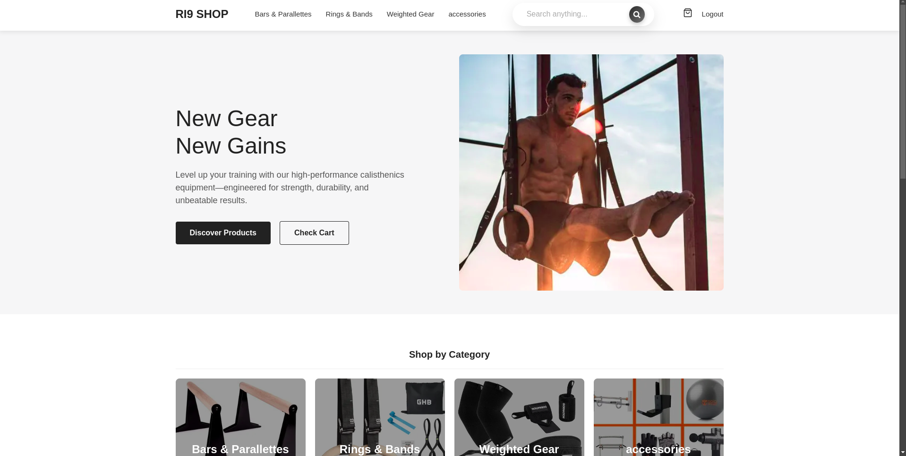
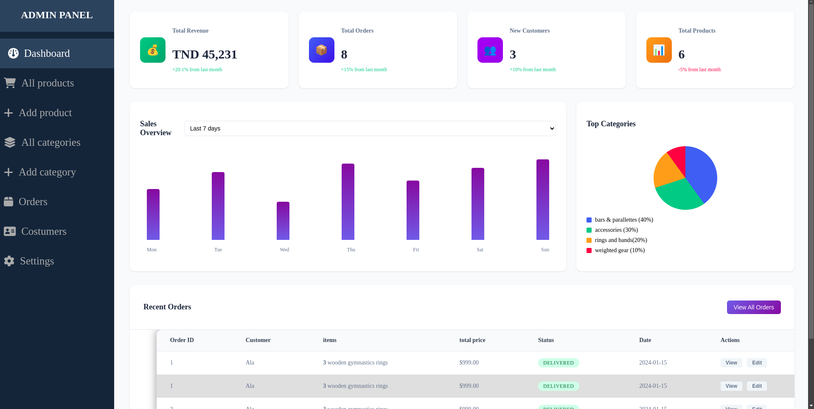
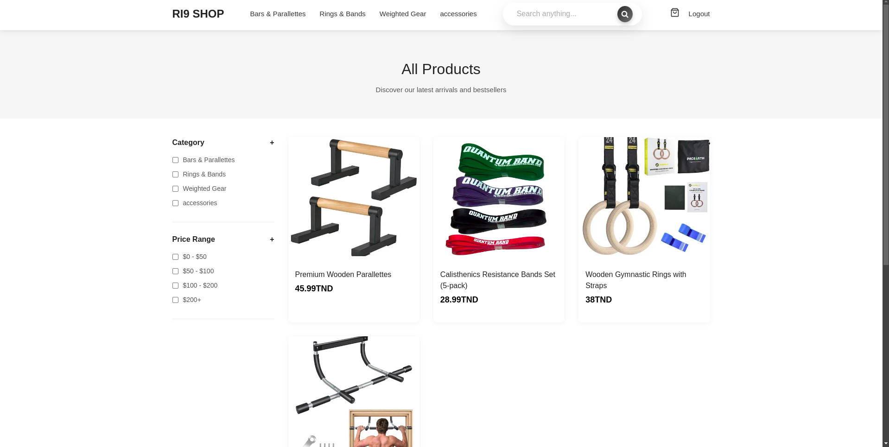
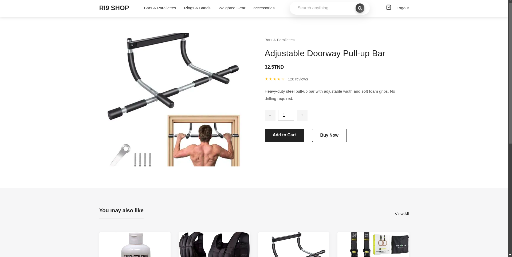
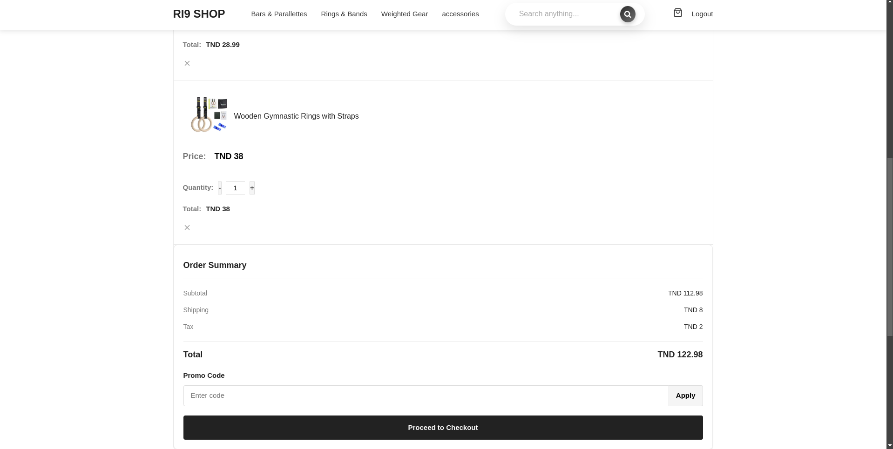
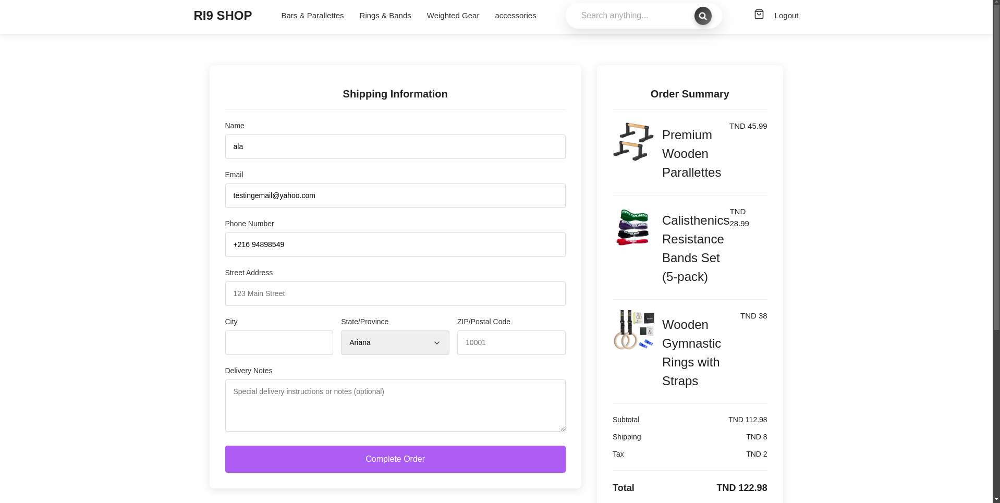
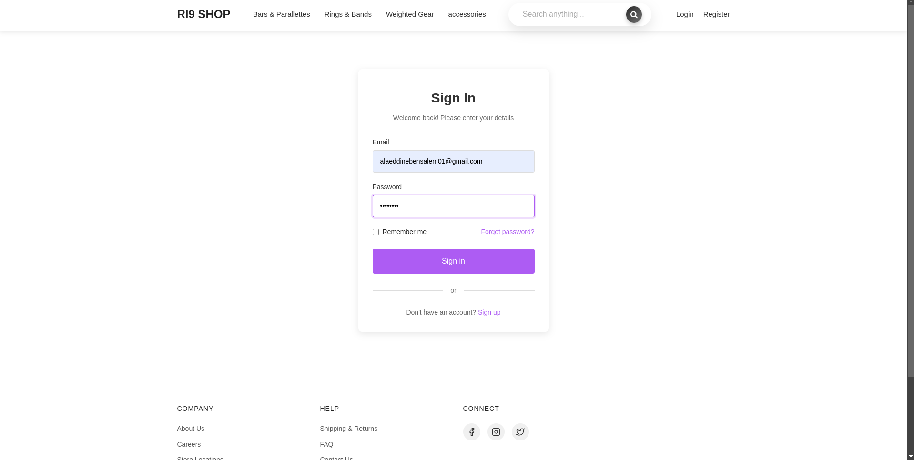
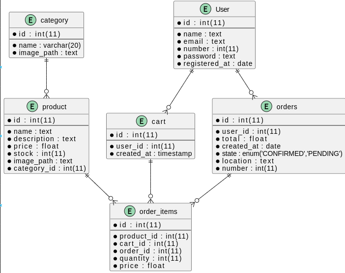

# E-Commerce Website Project (University Assignment)

  
*A responsive e-commerce platform built with HTML, CSS, PHP, and MySQL.*

## 📌 Table of Contents
- [Project Overview](#-project-overview)
- [Features](#-features)
- [Screenshots](#-screenshots)
- [Technologies Used](#-technologies-used)
- [Database Schema](#-database-schema)
- [Setup Instructions](#-setup-instructions)

---

## 🌟 Project Overview
This project is a **fully functional e-commerce website** developed as part of a university course. It includes user authentication, product catalog management, shopping cart functionality, and order processing. Built with a frontend (HTML/CSS) and backend (PHP/MySQL) stack, it demonstrates core web development principles.

---

## ✨ Features
### User Side
- ✅ **Account Management**: Register, login, and view order history.
- 🛒 **Shopping Cart**: Add/remove items, adjust quantities.
- 🔍 **Product Browsing**: Filter by categories, view details.
- 💳 **Checkout Process**: Order confirmation and summary.

### Admin Side *(if applicable)*
- 📊 **Dashboard**: View sales and user metrics.
- 🧺 **Product Management**: Add/edit/delete products.
- 📦 **Order Management**: Update order statuses.

---

## 📸 Screenshots
| Section | Preview |
|---------|---------|
| **Admin Dashboard** |  |
| **Homepage** |  |
| **Product Catalog** |  |
| **Product Details** |  |
| **Shopping Cart** |  |
| **Checkout Confirmation** |  |
| **User Login** |  |

[View all screenshots →](./docs/images/)

---

## 🛠 Technologies Used
- **Frontend**: HTML5, CSS3 (Flexbox/Grid), JavaScript (basic interactions).
- **Backend**: PHP (Rawww), MySQL.
- **Server**: XAMPP/LAMPP (Apache, MySQL).
- **Tools**: Git, phpMyAdmin.

---

## 🗃 Database Schema
The database includes tables for `users`, `products`, `orders`, and `order_items`. Key relationships:
- Users ↔ Orders (One-to-Many)
- Products ↔ Order Items (One-to-Many)  



---

## ⚙️ Setup Instructions
### Prerequisites
- XAMPP/LAMPP installed.
- Git (optional).

### Steps
1. **Clone the repo**:
   ```bash
   git clone github.com/AlaSww/Eshop_website
